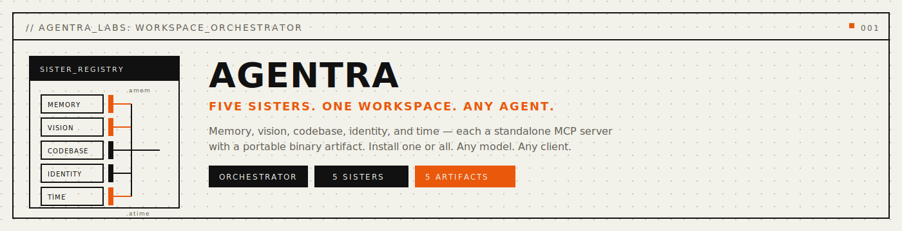

<p align="center">
  
</p>

<p align="center">
  <a href="https://github.com/agentralabs/agentic-memory"></a>
  <a href="https://github.com/agentralabs/agentic-vision"></a>
  <a href="https://github.com/agentralabs/agentic-codebase"></a>
  <a href="https://github.com/agentralabs/agentic-identity"></a>
  <a href="https://github.com/agentralabs/agentic-time"></a>
  <a href="LICENSE"></a>
</p>

<p align="center">
  <strong>Workspace orchestrator for the five Agentra sisters.</strong>
</p>

<p align="center">
  <a href="#sisters">Sisters</a> · <a href="#quick-start">Quick Start</a> · <a href="#install">Install</a> · <a href="#layout">Layout</a> · <a href="https://agentralab-tech-web.vercel.app">Docs</a>
</p>

---

<a name="sisters"></a>

## Sisters

| Sister | Artifact | What it does |
|--------|----------|-------------|
| [**AgenticMemory**](https://github.com/agentralabs/agentic-memory) | `.amem` | Persistent cognitive graph memory — facts, decisions, corrections, reasoning chains |
| [**AgenticVision**](https://github.com/agentralabs/agentic-vision) | `.avis` | Persistent visual memory — CLIP embeddings, similarity search, visual diff |
| [**AgenticCodebase**](https://github.com/agentralabs/agentic-codebase) | `.acb` | Semantic code intelligence — concept graphs, impact analysis, coupling detection |
| [**AgenticIdentity**](https://github.com/agentralabs/agentic-identity) | `.aid` | Cryptographic agent identity — Ed25519 anchors, signed receipts, trust delegation |
| [**AgenticTime**](https://github.com/agentralabs/agentic-time) | `.atime` | Temporal reasoning — deadlines, schedules, PERT estimation, decay models |

Each sister is an independent MCP server. Install one or all. Any model. Any client.

<a name="quick-start"></a>

## Quick Start

```bash
cargo install agentic-memory-cli    # amem
cargo install agentic-vision-cli    # avis
cargo install agentic-codebase-cli  # acb
cargo install agentic-identity-cli  # aid
cargo install agentic-time-cli      # atime
```

Or use the orchestrator:

```bash
cargo run --bin agentra -- status          # check what's installed
cargo run --bin agentra -- doctor          # health check + repair
cargo run --bin agentra -- doctor --fix    # auto-fix issues
```

<a name="install"></a>

## Install

```bash
./install_all.sh                    # install all sisters locally
./install_all.sh --profile=desktop  # desktop MCP client profile
./install_all.sh --profile=server   # server runtime profile
```

<a name="layout"></a>

## Layout

```
agentralabs-tech/
├── agentra-cli/       orchestrator CLI (agentra)
├── agentic-memory/    persistent graph memory
├── agentic-vision/    visual memory
├── agentic-codebase/  code graph + query engine
├── agentic-identity/  cryptographic agent identity
├── agentic-time/      temporal reasoning
├── install_all.sh     install sisters from local paths
├── sync_artifacts.sh  sync artifacts to server paths
└── scripts/           guardrail + consistency checks
```

---

<p align="center">
  Built by <a href="https://agentralab-tech-web.vercel.app">Agentra Labs</a>
</p>
