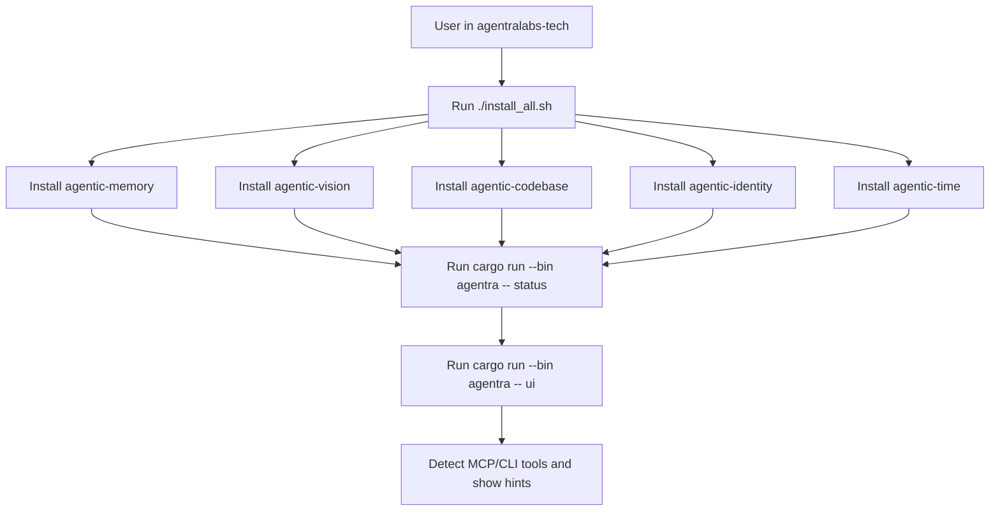

# AgentraLabs Tech Workspace

This repository is the top-level UX/orchestration workspace for the five core sister projects:

- `agentic-memory`
- `agentic-vision`
- `agentic-codebase`
- `agentic-identity`
- `agentic-time`

The sisters remain independently installable and independently runnable. This workspace adds a unified operator CLI (`agentra`) so users can quickly validate local setup and launch an interactive dashboard.

## What This Project Does

- Provides one workspace entrypoint for the Agentra sister ecosystem.
- Keeps each sister independently installable and runnable.
- Adds a fast operator UX (`agentra status` and `agentra ui`) to verify local readiness.
- Adds local install/test scripts for repeatable setup.

## Workspace Flow



## Goals

- Keep each sister project standalone.
- Provide a consistent top-level UX.
- Make setup/validation fast for local AI workflows.

## Layout

- `agentra-cli/` — unified orchestrator CLI (`agentra`)
- `agentic-memory/` — persistent graph memory tooling
- `agentic-vision/` — visual memory tooling
- `agentic-codebase/` — code graph + query tooling
- `agentic-identity/` — cryptographic agent identity tooling
- `agentic-time/` — temporal reasoning tooling (deadlines, schedules, decay)
- `install_all.sh` — install sisters from local paths
- `sync_artifacts.sh` — sync `.amem/.avis/.acb/.aid/.atime` artifacts to server paths
- `local_ai_test.sh` — simple local Ollama integration smoke script

## Current Published State (2026-02-25)

- `agentic-memory`: `0.3.2` (`agentic-memory`, `agentic-memory-ffi`, `agentic-memory-mcp`, `agentic-memory-cli`)
- `agentic-vision`: `0.2.2` (`agentic-vision`, `agentic-vision-ffi`, `agentic-vision-mcp`, `agentic-vision-cli`)
- `agentic-codebase`: `0.2.2` (`agentic-codebase`, `agentic-codebase-ffi`, `agentic-codebase-mcp`, `agentic-codebase-cli`)
- `agentic-identity`: `0.2.3` (`agentic-identity`, `agentic-identity-ffi`, `agentic-identity-mcp`, `agentic-identity-cli`)
- `agentic-time`: `0.1.0` (`agentic-time`, `agentic-time-ffi`, `agentic-time-mcp`, `agentic-time-cli`)

Quick install commands for the public CLIs:

```bash
cargo install agentic-memory-cli && amem --help
cargo install agentic-vision-cli && avis --version
cargo install agentic-codebase-cli && acb --version
cargo install agentic-identity-cli && aid --version
cargo install agentic-time-cli && atime --version
```

## Quick Start

From this directory:

```bash
cargo run --bin agentra -- status
cargo run --bin agentra -- status --session
cargo run --bin agentra -- ui
cargo run --bin agentra -- toggle codebase off
cargo run --bin agentra -- toggle codebase on
cargo run --bin agentra -- control on
```

UI controls:

- `r` refresh detection
- `h` show start hints
- `q` quit

`agentra status` reports each tool as:

- `OK`
- `DISABLED`
- `MISSING`

Health + repair:

```bash
cargo run --bin agentra -- doctor
cargo run --bin agentra -- doctor --fix
```

Backup and restore:

```bash
cargo run --bin agentra -- backup run
cargo run --bin agentra -- backup list
cargo run --bin agentra -- backup verify
```

Server takeover notes and preflight:

- Set `AGENTRA_RUNTIME_MODE=server` for server runtime.
- Server takeover requires `AGENTIC_TOKEN` or `AGENTIC_TOKEN_FILE`.
- To scan local artifact paths from server runtime, set `AGENTRA_ARTIFACT_DIRS=/path/a:/path/b`.
- Generate a token with `openssl rand -hex 32`.
- Cloud runtimes cannot read laptop files directly; sync artifacts first with `./sync_artifacts.sh`.

```bash
cargo run --bin agentra -- server preflight
# add --strict in CI/automation once env is configured
```

