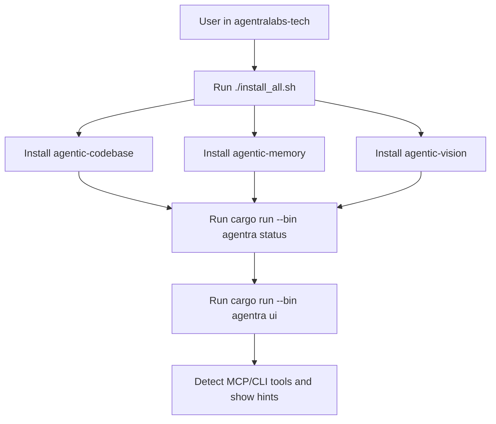
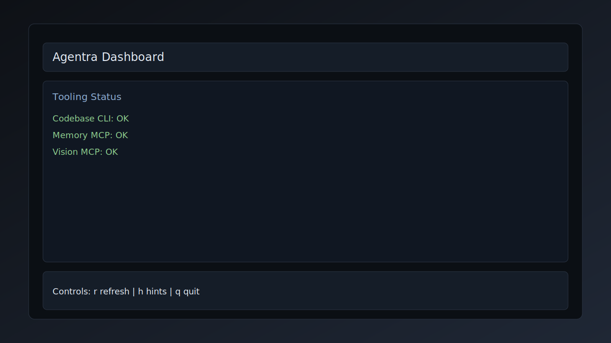
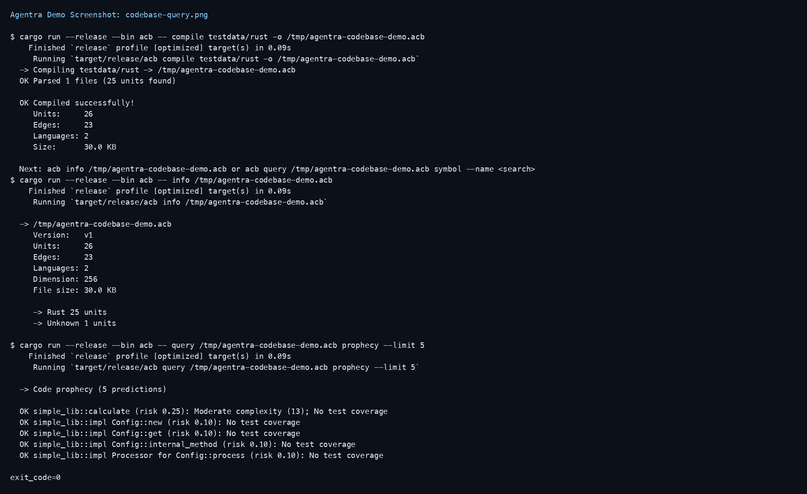
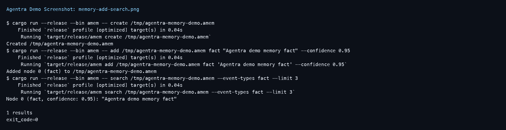
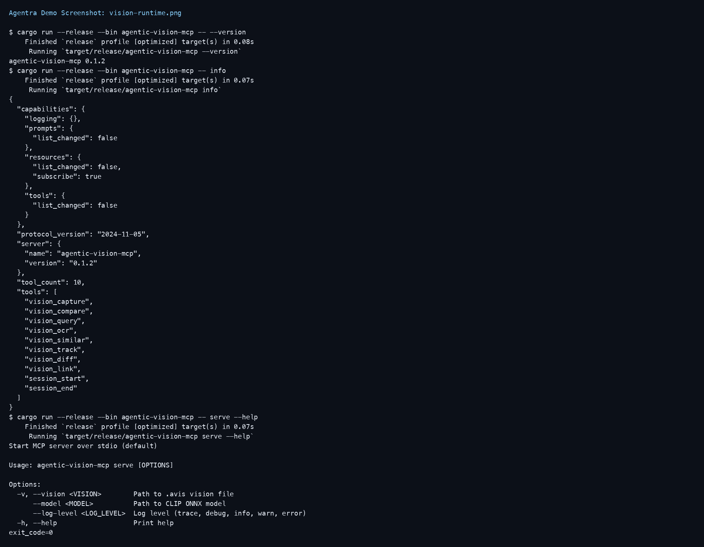
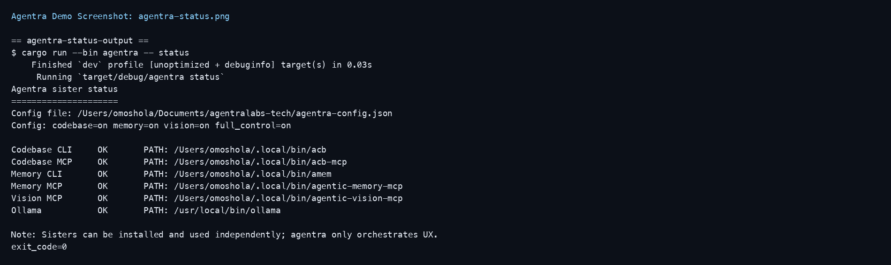
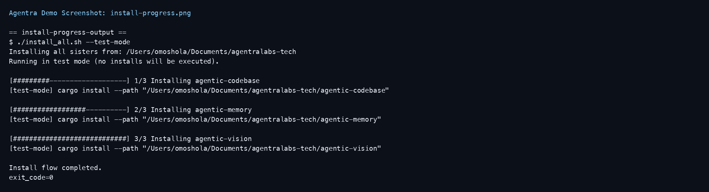
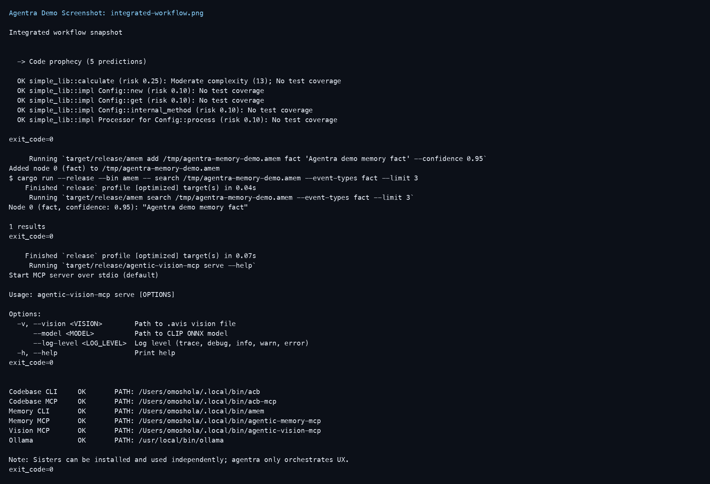

# AgentraLabs Tech Workspace

This repository is the top-level UX/orchestration workspace for the three core sister projects:

- `agentic-codebase`
- `agentic-memory`
- `agentic-vision`

The sisters remain independently installable and independently runnable. This workspace adds a unified operator CLI (`agentra`) so users can quickly validate local setup and launch an interactive dashboard.

## What This Project Does

- Provides one workspace entrypoint for the Agentra sister ecosystem.
- Keeps each sister independently installable and runnable.
- Adds a fast operator UX (`agentra status` and `agentra ui`) to verify local readiness.
- Adds local install/test scripts for repeatable setup.

## Workspace Flow



## Goals

- Keep each sister project standalone.
- Provide a consistent top-level UX.
- Make setup/validation fast for local AI workflows.

## Layout

- `agentra-cli/` — unified orchestrator CLI (`agentra`)
- `agentic-codebase/` — code graph + query tooling
- `agentic-memory/` — persistent graph memory tooling
- `agentic-vision/` — visual memory tooling
- `install_all.sh` — install sisters from local paths
- `local_ai_test.sh` — simple local Ollama integration smoke script

## Quick Start

From this directory:

```bash
cargo run --bin agentra status
cargo run --bin agentra ui
cargo run --bin agentra -- toggle codebase off
```

UI controls:

- `r` refresh detection
- `h` show start hints
- `q` quit

`agentra status` reports each tool as:

- `OK`
- `DISABLED`
- `MISSING`

## UI Screenshot

<p align="center">
  
</p>

## Sisters Runtime Screenshots

Real runtime captures generated from live commands:

<p align="center">
  
</p>
<p align="center">
  
</p>
<p align="center">
  
</p>
<p align="center">
  
</p>
<p align="center">
  
</p>
<p align="center">
  
</p>

See [How-To Guide](docs/how-to.md) for step-by-step usage.

## Install Sisters (Local)

```bash
./install_all.sh
```

This script installs binaries from each sister repo using `cargo install --path ...` and shows progress.

Dry-run test mode:

```bash
./install_all.sh --test-mode
```

Help:

```bash
./install_all.sh --help
```

## Local AI Smoke Test

```bash
./local_ai_test.sh
```

Requires:

- `ollama` available in `PATH`
- model `llama3` available locally

## Build and Package

Build orchestrator:

```bash
cargo build --release -p agentra-cli
```

Package orchestrator crate:

```bash
cargo package -p agentra-cli
```

## Project Policy

- The orchestrator must not force a monolithic install.
- Missing tools should be reported as `MISSING` with actionable hints.
- Sister repos stay versioned and shipped independently.
