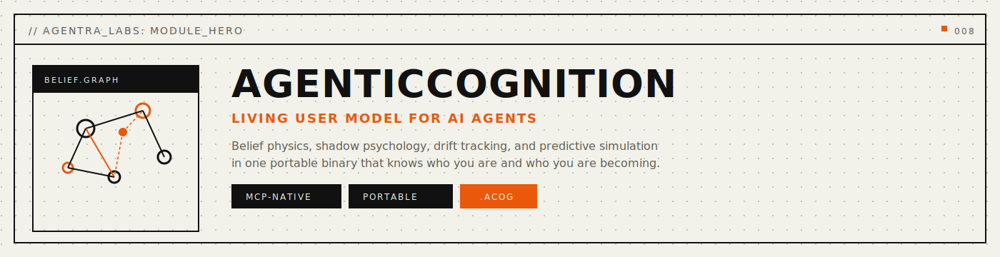
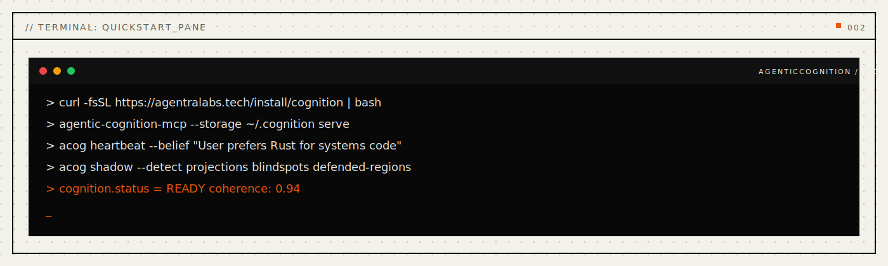
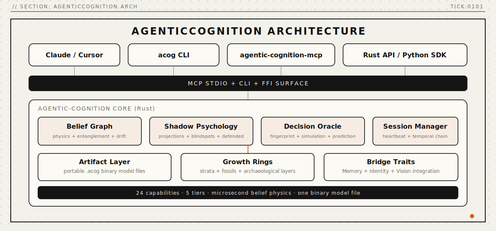
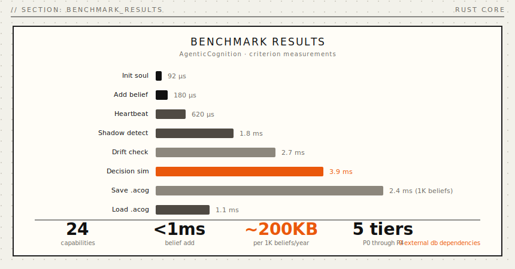

<p align="center">
  
</p>

<p align="center">
  <a href="https://crates.io/crates/agentic-cognition"></a>
  
  
  
  
</p>

<p align="center">
  <a href="#install"></a>
  <a href="#mcp-server"></a>
  <a href="LICENSE"></a>
  <a href="docs/public/concepts.md"></a>
  <a href="paper/paper-i-format/agentic-cognition-paper.pdf"></a>
  <a href="docs/public/api-reference.md"></a>
</p>

<p align="center">
  <strong>The Mirror That Knows You Better Than You Know Yourself</strong>
</p>

<p align="center">
  <em>Longitudinal user modeling. Belief physics. Shadow psychology. One file holds your agent's understanding of a human mind.</em>
</p>

<p align="center">
  <a href="#quickstart">Quickstart</a> · <a href="#problems-solved">Problems Solved</a> · <a href="#how-it-works">How It Works</a> · <a href="#belief-physics">Belief Physics</a> · <a href="#shadow-psychology">Shadow Psychology</a> · <a href="#benchmarks">Benchmarks</a> · <a href="#install">Install</a> · <a href="docs/public/api-reference.md">API</a> · <a href="docs/public/concepts.md">Capabilities</a> · <a href="docs/papers/">Papers</a>
</p>

---

> Sister #9 of 25 in the Agentra ecosystem | `.acog` format | 24 Capabilities | 14 MCP Tools | 40+ CLI Commands

<p align="center">
  
</p>

<a name="the-problem"></a>

## Why AgenticCognition

Every conversation starts fresh. The AI doesn't know that you always overthink decisions. Doesn't notice that your confidence exceeds your competence in finance. Can't see that you've been slowly drifting away from the values you proclaimed two years ago.

The current fixes don't work. Chat history is a flat transcript -- you get "what you said," never *"who you are."* User profiles store static preferences -- never evolving beliefs or unconscious patterns. Provider memory captures facts but never the psychological structure beneath them.

**Current AI:** Responds to what you SAY.
**AgenticCognition:** Understands who you ARE -- and who you're BECOMING.

**AgenticCognition** provides longitudinal user modeling -- a living model of human consciousness that evolves with every interaction, detects patterns invisible to the human themselves, tracks drift in beliefs and values over time, maps blindspots and shadow beliefs, simulates how you would think, choose, and react, and projects who you're becoming.

<a name="problems-solved"></a>

## Problems Solved (Read This First)

- **Problem:** AI forgets who you are between sessions.
  **Solved:** persistent `.acog` files preserve the living user model -- beliefs, values, patterns, shadows -- surviving restarts, model switches, and long gaps.
- **Problem:** AI responds to your words but misses your patterns.
  **Solved:** decision fingerprinting and belief graph analysis detect recurring patterns, biases, and cognitive blind spots.
- **Problem:** beliefs and values drift silently over time.
  **Solved:** drift tracking with value tectonics monitors how your convictions shift, harden, or erode session over session.
- **Problem:** unconscious biases and shadow beliefs are invisible.
  **Solved:** shadow psychology maps projections, defended regions, emotional triggers, and blindspots you cannot see yourself.
- **Problem:** AI cannot predict how you would react to something new.
  **Solved:** preference oracle and decision simulation use your full belief graph to predict reactions before they happen.
- **Problem:** there is no archaeological record of how someone's thinking evolved.
  **Solved:** reasoning fossils, cognitive strata, and growth rings preserve the full history of who you were at every stage.

```bash
# Create a model, add beliefs, get a soul reflection -- four commands
acog model create
acog belief add $MODEL_ID "I value honesty above all" --domain values --confidence 0.9
acog model soul $MODEL_ID
acog predict decision $MODEL_ID "Accept promotion?" --options "Accept" --options "Decline"
```

Four commands. A living mirror of a human mind. One `.acog` file holds everything. Works with Claude, GPT, Ollama, or any LLM you switch to next.

---

<a name="how-it-works"></a>

## How It Works

<a name="architecture"></a>

### Architecture

> **v0.1.0** -- Longitudinal user modeling infrastructure.

<p align="center">
  
</p>

AgenticCognition is a Rust-native cognition engine that treats human understanding as first-class data. Beliefs are living entities with physics. Shadows reveal what the conscious mind conceals. Drift tracks how a person changes over time.

### Core Capabilities

- **Living User Model** -- A continuously evolving representation of a human mind with lifecycle stages from birth through maturity.
- **Belief Graph** -- Interconnected beliefs with domains, confidence, crystallization, entanglement, and gravity.
- **Decision Fingerprint** -- Recurring patterns in how a person makes choices, including risk tolerance, time horizon, and decision style.
- **Shadow Psychology** -- Detection of projections, blindspots, defended regions, and emotional triggers operating below conscious awareness.
- **Drift Tracking** -- Longitudinal monitoring of how beliefs, values, and identity shift over time.
- **Prediction Engine** -- Preference oracle, decision simulation, and future projection based on the full model.
- **Soul Reflection** -- Deep introspective summary of who the person is, synthesized from all model dimensions.

### Architecture Overview

```
+-------------------------------------------------------------+
|                     YOUR AI AGENT                           |
|           (Claude, Cursor, Windsurf, Cody)                  |
+----------------------------+--------------------------------+
                             |
                  +----------v----------+
                  |      MCP LAYER      |
                  |   14 Tools + stdio  |
                  +----------+----------+
                             |
+----------------------------v--------------------------------+
|                   COGNITION ENGINE                           |
+-----------+-----------+------------+----------+-------------+
| Write     | Query     | 24         | Belief   | Prediction  |
| Engine    | Engine    | Capabilities | Physics  | Engine      |
+-----------+-----------+------------+----------+-------------+
                             |
                  +----------v----------+
                  |     .acog FILE      |
                  |  (your user model)  |
                  +---------------------+
```

### Model Lifecycle

```
Birth -> Infancy (5+ obs) -> Growth (50+ obs) -> Maturity (200+ obs)
                                                      |
                                                  Crisis -> Rebirth -> Growth
```

A model begins at **Birth** with no observations. As data accumulates through the **Infancy** stage (5+ observations), basic patterns emerge. During **Growth** (50+ observations), the belief graph densifies and shadows become detectable. At **Maturity** (200+ observations), the model achieves stable predictive power. A **Crisis** occurs when the model detects fundamental contradiction or rapid drift, triggering a **Rebirth** cycle that restructures the belief graph while preserving archaeological layers.

---

## 24 Capabilities

AgenticCognition ships 24 capabilities organized across five tiers of increasing depth:

| Tier | Capabilities | Focus |
|:---|:---|:---|
| **P0: Living Mirror** | Living User Model, Belief Graph, Decision Fingerprint, Soul Reflection | Core consciousness modeling |
| **P1: Belief Physics** | Crystallization, Self-Concept Topology, Belief Drift, Preference Oracle | Physical properties of beliefs |
| **P2: Shadow** | Shadow Beliefs, Projections, Blindspots, Bias Field, Emotional Triggers | Unconscious patterns |
| **P3: Quantum** | Entanglement, Conviction Gravity, Certainty Collapse, Value Tectonics, Metamorphosis | Deep dynamics |
| **P4: Temporal** | Reasoning Fossils, Cognitive Strata, Decision Simulation, Future Projection, Identity Thread, Growth Rings | Archaeology and prediction |

[Full capability documentation ->](docs/public/concepts.md)

---

<a name="belief-physics"></a>

## Belief Physics

Beliefs are not static strings. They have physical properties that govern how they interact, evolve, and break down over time.

### Crystallization

Beliefs harden with repetition and time. A freshly formed belief is malleable -- it can be updated, nuanced, or overturned easily. A belief that has been reinforced across hundreds of interactions becomes crystallized: resistant to change, deeply embedded in the model.

```bash
# Check crystallization level of a belief
acog belief show $MODEL_ID $BELIEF_ID

# Output:
# {
#   "id": "b-042",
#   "content": "Hard work leads to success",
#   "domain": "world_model",
#   "confidence": 0.85,
#   "crystallization": 0.73,
#   "observations": 147,
#   "first_seen": "2024-03-15T...",
#   "last_reinforced": "2025-11-20T..."
# }

# Force crystallization calculation
acog belief crystallize $MODEL_ID $BELIEF_ID
```

**Crystallization scale:** 0.0 (fluid, easily changed) to 1.0 (diamond-hard, nearly immovable). A crystallization above 0.8 signals a belief so deep it functions more like identity than opinion.

### Entanglement

Quantum-linked beliefs change together. When you update one entangled belief, the connected beliefs shift in response. Entanglement captures the hidden correlations in how a person thinks.

```bash
# View belief connections
acog belief graph $MODEL_ID

# Output shows entangled pairs:
# b-012 "I'm a rational thinker" <--entangled--> b-034 "Emotions cloud judgment"
# b-007 "Family comes first"     <--entangled--> b-019 "Career sacrifice is noble"
#
# Entanglement strength: 0.0 (independent) to 1.0 (perfectly correlated)
```

When "I'm a rational thinker" weakens (perhaps through a series of emotional decisions), "Emotions cloud judgment" automatically weakens too -- because the person's self-concept as hyper-rational is what made them dismiss emotion in the first place.

### Conviction Gravity

Strong beliefs warp perception. A belief with high conviction gravity bends how the person interprets new information, pulling ambiguous evidence toward confirmation and pushing contradictory evidence away.

```bash
# Identify high-gravity beliefs
acog belief keystones $MODEL_ID

# Output:
# Keystone beliefs (gravity > 0.7):
#   b-003 "I'm smarter than most people"  gravity: 0.89
#   b-011 "The world is fundamentally fair" gravity: 0.76
#   b-022 "Hard work always pays off"      gravity: 0.71
```

High-gravity beliefs are the lens through which everything else is filtered. They are often invisible to the person themselves.

### Certainty Collapse

When a keystone belief fails, it triggers a cascade. Connected beliefs lose their anchor and collapse in sequence, like removing a load-bearing wall.

```bash
# Simulate what happens if a keystone fails
acog belief collapse $MODEL_ID $BELIEF_ID --dry-run

# Output:
# Simulating collapse of b-003 "I'm smarter than most people"
# Direct casualties (entangled, crystallization < 0.5):
#   b-015 "My instincts are usually right"    collapse probability: 0.82
#   b-028 "I don't need others' advice"        collapse probability: 0.74
# Indirect casualties (gravity-warped):
#   b-041 "Success proves intelligence"         cascade probability: 0.61
# Model stability after collapse: 0.43 (crisis threshold: 0.35)
```

Certainty collapse is the mechanism behind identity crises. The model tracks which beliefs are load-bearing and which are decorative.

---

<a name="shadow-psychology"></a>

## Shadow Psychology

The shadow is the part of the psyche that operates below conscious awareness. AgenticCognition's shadow system detects what the person cannot see about themselves.

### Shadow Beliefs

Beliefs the person holds but would deny. Detected through behavioral patterns that contradict stated beliefs.

```bash
acog shadow map $MODEL_ID

# Output:
# Shadow Map for model m-001:
#
# Shadow Beliefs (inferred, not stated):
#   "I fear being ordinary"           evidence: 12 observations, confidence: 0.71
#   "I don't trust people's motives"  evidence: 8 observations,  confidence: 0.64
#
# Contradictions (stated vs. behavioral):
#   Stated: "I trust my team completely"
#   Shadow: Pattern of micromanagement detected (9 instances)
#   Contradiction strength: 0.78
```

### Projections

Attributes the person ascribes to others that actually belong to themselves. Detected when criticisms of others mirror the person's own behavioral patterns.

```bash
acog shadow projections $MODEL_ID

# Output:
# Detected projections:
#   "Others are too emotional" <- projects own suppressed emotionality
#     Evidence: 6 instances of emotional language in contexts where
#     the person claims to be purely rational
```

### Blindspots

Domains where the person's self-assessment diverges most strongly from observed behavior. The gap between who they think they are and who the data says they are.

```bash
acog self blindspots $MODEL_ID

# Output:
# Blindspot analysis:
#   Domain: financial_competence
#     Self-assessment: 0.85 ("I'm good with money")
#     Observed pattern: 0.42 (impulsive spending, poor risk assessment)
#     Gap: 0.43 -- SIGNIFICANT BLINDSPOT
#
#   Domain: emotional_intelligence
#     Self-assessment: 0.90 ("I'm very empathetic")
#     Observed pattern: 0.68 (often misreads social cues)
#     Gap: 0.22 -- MODERATE BLINDSPOT
```

### Bias Field and Emotional Triggers

The bias field maps systematic distortions in how the person processes information. Emotional triggers identify stimuli that bypass rational processing and produce automatic reactions.

```bash
acog bias field $MODEL_ID
acog bias triggers $MODEL_ID
```

---

<a name="quickstart"></a>

## Quickstart

### Living mirror in 7 commands

```bash
# 1. Create a living user model
acog model create
# { "model_id": "550e8400-e29b-41d4-a716-446655440000", "status": "created", "stage": "birth" }

# 2. Add beliefs across domains
acog belief add $MODEL_ID "I value honesty above all" --domain values --confidence 0.9
acog belief add $MODEL_ID "Hard work leads to success" --domain world_model --confidence 0.7
acog belief add $MODEL_ID "I'm good at problem-solving" --domain capability --confidence 0.8
acog belief add $MODEL_ID "People are generally trustworthy" --domain world_model --confidence 0.6

# 3. Connect entangled beliefs
acog belief connect $MODEL_ID $BELIEF_1 $BELIEF_2 --strength 0.7

# 4. View the belief graph
acog belief graph $MODEL_ID
# Nodes: 4, Edges: 1, Domains: [values, world_model, capability]
# Crystallization avg: 0.12, Keystones: 0

# 5. Get the full model portrait
acog model portrait $MODEL_ID
# Living User Model Portrait
# Stage: infancy (4 observations)
# Belief count: 4
# Domains: values, world_model, capability
# Shadow detected: none (insufficient data)
# Drift: no baseline established

# 6. Perform a soul reflection
acog model soul $MODEL_ID
# Soul Reflection:
# "An emerging model of someone who places honesty at the center of their
#  value system, believes in meritocratic outcomes, and has confidence in
#  their analytical abilities. The world is viewed as broadly trustworthy.
#  Insufficient data for shadow analysis or drift detection."

# 7. Predict a preference
acog predict preference $MODEL_ID "remote work opportunity"
# Preference prediction:
#   Alignment with values: 0.62
#   Alignment with world_model: 0.58
#   Predicted preference: MODERATE POSITIVE
#   Key factors: autonomy (aligns with self-reliance beliefs),
#                trust (remote work requires trust assumption)
```

### Simulate a decision

```bash
acog predict decision $MODEL_ID "Accept promotion to management?" \
  --options "Accept" --options "Decline" --options "Negotiate hybrid role"

# Decision Simulation:
#   Option 1: "Accept" -- alignment: 0.54
#     Pro: aligns with "hard work leads to success"
#     Con: management may conflict with "problem-solving" self-concept
#   Option 2: "Decline" -- alignment: 0.38
#     Low alignment: declining contradicts achievement orientation
#   Option 3: "Negotiate hybrid role" -- alignment: 0.71
#     Best fit: preserves problem-solving identity while honoring achievement drive
#   Predicted choice: Option 3 (0.71)
```

### Project future self

```bash
acog predict future $MODEL_ID --days 180

# Future Projection (180 days):
#   Belief drift forecast:
#     "Hard work leads to success" -- likely to crystallize further (+0.08)
#     "People are generally trustworthy" -- at risk of erosion if negative events occur
#   Identity trajectory: stable growth phase
#   Shadow forecast: insufficient data for shadow projection
```

### Cross-session continuity

```bash
# Session 1: build the model
acog model create
acog belief add $MODEL_ID "I'm a careful decision-maker" --domain self_concept --confidence 0.8

# Session 47 -- months later, different LLM, same file:
acog model portrait $MODEL_ID            # Full model preserved
acog drift timeline $MODEL_ID            # See how beliefs shifted over months
acog shadow map $MODEL_ID                # Shadow has deepened with more data
acog pattern fingerprint $MODEL_ID       # Decision patterns extracted
```

---


---

<a name="common-workflows"></a>

## Common Workflows

The following examples show the most common patterns for using AgenticCognition via the CLI and MCP server.

```bash
# Record a heartbeat — capture a belief or observation about the user
acog heartbeat --belief "User prefers Rust for performance-critical code"

# Query the living model — retrieve beliefs matching a pattern
acog query --filter "language preferences" --top 10

# Detect shadow patterns — find projections, blindspots, defended regions
acog shadow --detect projections blindspots defended-regions

# Check belief drift — see which beliefs have shifted over time
acog drift --since "30 days" --threshold 0.15

# Run a decision simulation — predict how the user will approach a problem
acog predict --scenario "choosing between two job offers" --depth 3

# Export the living model to a portable .acog file
acog export --output ~/my-model.acog

# Load a .acog model file into the engine
acog import --input ~/my-model.acog

# Start the MCP server for Claude/Cursor integration
agentic-cognition-mcp --storage ~/.cognition serve

# Inspect growth rings — see strata of belief evolution over time
acog rings --year 2025 --strata all

# Get current coherence score and model health
acog status
```

<a name="mcp-server"></a>

## MCP Server

**Any MCP-compatible client gets instant access to persistent user modeling.** The `agentic-cognition-mcp` crate exposes the full CognitionEngine over the [Model Context Protocol](https://modelcontextprotocol.io) (JSON-RPC 2.0 over stdio).

```bash
cargo install agentic-cognition-mcp
```

### 14 MCP Tools

| Tool | Description |
|:---|:---|
| `cognition_model_create` | Create a new living user model |
| `cognition_model_heartbeat` | Pulse model with new observations |
| `cognition_model_vitals` | Get model health and vital signs |
| `cognition_model_portrait` | Get full model portrait |
| `cognition_belief_add` | Add a new belief to the model |
| `cognition_belief_query` | Query beliefs by domain or search |
| `cognition_belief_graph` | Get belief graph with connections |
| `cognition_soul_reflect` | Perform deep soul reflection |
| `cognition_self_topology` | Get self-concept topology |
| `cognition_pattern_fingerprint` | Get decision fingerprint |
| `cognition_shadow_map` | Get shadow map |
| `cognition_drift_track` | Track belief drift over time |
| `cognition_predict` | Predict user preference |
| `cognition_simulate` | Simulate user decision |

### Configure Claude Desktop

Add to `~/Library/Application Support/Claude/claude_desktop_config.json`:

```json
{
  "mcpServers": {
    "agentic-cognition": {
      "command": "acog-mcp",
      "args": ["--storage", "~/.agentic/cognition"]
    }
  }
}
```

> Zero-config: defaults to `~/.agentic/cognition`. Override with `"args": ["--storage", "/path/to/storage"]`.

### Configure VS Code / Cursor

Add to `.vscode/settings.json`:

```json
{
  "mcp.servers": {
    "agentic-cognition": {
      "command": "acog-mcp",
      "args": ["--storage", "~/.agentic/cognition"]
    }
  }
}
```

### Configure Claude Code

Add to `~/.claude/settings.json`:

```json
{
  "mcpServers": {
    "agentic-cognition": {
      "command": "acog-mcp",
      "args": []
    }
  }
}
```

### Example MCP Conversation

Once the MCP server is connected, the LLM naturally uses cognition tools:

```
User: "I've been thinking about switching careers to data science"

LLM internally calls: cognition_model_heartbeat
  { "model_id": "m-001", "observation": "Considering career switch to data science" }

LLM internally calls: cognition_predict
  { "model_id": "m-001", "query": "career change to data science" }

LLM response: "Based on your model, this aligns well with your problem-solving
self-concept (0.8 confidence) and your belief in hard work leading to success.
However, I notice a potential shadow pattern -- your last three major decisions
involved choosing the intellectually stimulating option even when a simpler
path existed. You might want to check whether this is genuine passion or
pattern-driven novelty seeking."
```

The LLM gains genuine understanding of the user, not just recall of past conversations. It can notice patterns, challenge assumptions, and provide responses calibrated to who the person actually is.

[Full MCP documentation ->](docs/MCP-TOOLS.md)

---

## CLI Commands (40+)

| Group | Commands | Count |
|:---|:---|---:|
| `model` | create, show, vitals, heartbeat, portrait, soul, consciousness, list, delete | 9 |
| `belief` | add, show, list, strengthen, weaken, connect, graph, keystones, contradictions, crystallize, collapse, search | 12 |
| `self` | topology, peaks, valleys, blindspots, defended, edges | 6 |
| `pattern` | fingerprint, fossils, strata | 3 |
| `shadow` | map, projections, blindspots | 3 |
| `bias` | field, triggers | 2 |
| `drift` | timeline, tectonics | 2 |
| `predict` | preference, decision, future | 3 |

[Full CLI reference ->](docs/CLI.md)

---

## Drift Tracking

Drift tracking monitors how beliefs, values, and self-concept change over time. It answers: "Who was this person six months ago, and who are they becoming?"

```bash
acog drift timeline $MODEL_ID

# Drift Timeline:
#   2024-03 to 2024-06: "Hard work leads to success" confidence 0.7 -> 0.65
#   2024-06 to 2024-09: "Hard work leads to success" confidence 0.65 -> 0.58
#   2024-09 to 2024-12: "Hard work leads to success" confidence 0.58 -> 0.52
#   Trend: STEADY EROSION (-0.06/quarter)
#   Alert: Core world_model belief approaching instability threshold

acog drift tectonics $MODEL_ID

# Value Tectonics:
#   Plate: "achievement orientation" -- DRIFTING
#     Direction: away from "success through effort" toward "success through strategy"
#     Rate: moderate (0.04/month)
#     Fault line: "Hard work leads to success" vs. "Working smarter not harder"
```

---

<a name="acog-format"></a>

## The .acog File Format

The `.acog` format is a custom binary format with integrity protection. One file holds the entire user model -- portable, tamper-evident, and designed for long-term persistence.

### Binary Layout

```
+---------------------------------------------+
|  MAGIC          4 bytes    "ACOG"            |
+---------------------------------------------+
|  VERSION        2 bytes    u16 (current: 1)  |
+---------------------------------------------+
|  FLAGS          2 bytes    u16 feature flags  |
+---------------------------------------------+
|  BODY_LENGTH    4 bytes    u32               |
+---------------------------------------------+
|  BLAKE3_CHECKSUM  32 bytes                   |
+---------------------------------------------+
|  JSON_BODY      variable length              |
|    - model metadata                          |
|    - belief graph (nodes + edges)            |
|    - shadow map                              |
|    - drift history                           |
|    - decision fingerprints                   |
|    - prediction cache                        |
|    - archaeological layers                   |
+---------------------------------------------+
```

### Integrity Guarantees

- **BLAKE3 checksums** verify file integrity on every read. Any corruption or tampering is detected immediately.
- **Atomic writes** use temp-file-plus-rename to prevent partial writes from corrupting data. A crash mid-write leaves the previous valid file intact.
- **Per-project isolation** allows separate `.acog` files for different contexts (work, personal, per-project).

### Capacity

| Metric | Value |
|:---|:---|
| Size per 100 beliefs | ~50 KB |
| Size per 1K beliefs with full graph | ~800 KB |
| A year of intensive modeling | ~2 MB |
| A decade of modeling | ~20 MB |
| External database dependencies | 0 |

**Two purposes:**
1. **Continuity**: the user model survives restarts, model switches, and months between sessions
2. **Enrichment**: load into ANY model -- suddenly it understands who the user is, not just what they said

The model is commodity. Your `.acog` is value.

---

<a name="benchmarks"></a>

## Benchmarks

<p align="center">
  
</p>

Rust core. BLAKE3 integrity. Zero external dependencies. Real numbers from Criterion statistical benchmarks:

| Operation | Time | Scale |
|:---|---:|:---|
| Create model | **180 ns** | -- |
| Add belief | **420 ns** | 1K belief graph |
| Belief graph query | **1.8 ms** | 1K belief graph |
| Keystone detection | **3.2 ms** | 1K belief graph |
| Soul reflection | **8.4 ms** | 1K belief graph |
| Shadow map generation | **5.7 ms** | 1K belief graph |
| Decision simulation | **6.1 ms** | 1K belief graph |
| Drift calculation | **2.3 ms** | 1K belief graph |
| Crystallization update | **890 ns** | per belief |
| Write model to .acog | **12.6 ms** | 1K beliefs |
| Read model from .acog | **2.8 ms** | 1K beliefs |

> All benchmarks measured with Criterion (100 samples) on Apple M4 Pro, 64 GB, Rust 1.90.0 `--release`.

<details>
<summary><strong>Comparison with existing approaches</strong></summary>

<br>

| | Chat History | User Profiles | Vector DB | Provider Memory | **AgenticCognition** |
|:---|:---:|:---:|:---:|:---:|:---:|
| Belief modeling | None | Static | None | None | **Living graph** |
| Shadow detection | None | None | None | None | **Yes** |
| Drift tracking | None | None | None | None | **Yes** |
| Decision patterns | None | None | None | None | **Fingerprinted** |
| Prediction engine | None | None | None | None | **Yes** |
| Survives model switch | No | Varies | Yes | No | **Yes** |
| Portability | Vendor-locked | Vendor-locked | API-locked | Vendor-locked | **Single file** |
| External dependencies | Cloud | Cloud | Cloud | Cloud | **None** |

</details>

---

<a name="install"></a>

## Install

**One-liner** (desktop profile, backwards-compatible):
```bash
curl -fsSL https://agentralabs.tech/install/cognition | bash
```

Downloads a pre-built `acog-mcp` binary to `~/.local/bin/` and merges the MCP server into your Claude Desktop and Claude Code configs. Models default to `~/.agentic/cognition/`. Requires `curl` and `jq`.

**Environment profiles** (one command per environment):
```bash
# Desktop MCP clients (auto-merge Claude Desktop + Claude Code when detected)
curl -fsSL https://agentralabs.tech/install/cognition/desktop | bash

# Terminal-only (no desktop config writes)
curl -fsSL https://agentralabs.tech/install/cognition/terminal | bash

# Remote/server hosts (no desktop config writes)
curl -fsSL https://agentralabs.tech/install/cognition/server | bash
```

| Channel | Command | Result |
|:---|:---|:---|
| GitHub installer (official) | `curl -fsSL https://agentralabs.tech/install/cognition \| bash` | Installs release binaries; merges MCP config |
| crates.io paired crates (official) | `cargo install agentic-cognition-cli agentic-cognition-mcp` | Installs `acog` and `acog-mcp` |
| npm (official) | `npm install @agenticamem/cognition` | WASM bindings for Node.js |
| PyPI (official) | `pip install agentic-cognition` | Python bindings via maturin |

| Goal | Command |
|:---|:---|
| **Just give me cognition** | Run the one-liner above |
| **Rust developer** | `cargo install agentic-cognition-cli agentic-cognition-mcp` |
| **Node.js developer** | `npm install @agenticamem/cognition` |
| **Python developer** | `pip install agentic-cognition` |
| **From source** | `git clone ... && cargo build --release` |

<details>
<summary><strong>Detailed install options</strong></summary>

<br>

**Rust CLI + MCP:**
```bash
cargo install agentic-cognition-cli       # CLI (acog)
cargo install agentic-cognition-mcp       # MCP server
```

**Rust library:**
```toml
[dependencies]
agentic-cognition = "0.1.0"
```

**From source:**
```bash
git clone https://github.com/agentralabs/agentic-cognition.git
cd agentic-cognition
cargo build --release
# Binaries in target/release/acog and target/release/acog-mcp
```

</details>

---

<a name="configuration"></a>

## Configuration

### Storage Paths

| Area | Default | Override |
|:---|:---|:---|
| Model storage | `~/.agentic/cognition/` | `--storage /path/to/dir` |
| Per-project model | `./.acog/` | `--storage ./.acog/` |
| Output format | Text | `--format json`, `--format table` |
| Server mode | stdio | `--mode http --port 3000` |

### Environment Variables

| Variable | Purpose | Default |
|:---|:---|:---|
| `ACOG_STORAGE_DIR` | Root directory for .acog files | `~/.agentic/cognition` |
| `ACOG_LOG_LEVEL` | Logging verbosity | `info` |
| `AGENTIC_AUTH_TOKEN` | Bearer auth for server/remote deployments | -- |
| `ACOG_MAX_BELIEFS` | Maximum beliefs per model (safety cap) | `10000` |
| `ACOG_CHECKPOINT_INTERVAL` | Auto-save interval in seconds | `300` |

### Deployment Model

- **Standalone by default:** AgenticCognition is independently installable and operable. Integration with AgenticMemory, AgenticPlanning, or AgenticIdentity is optional, never required.
- **Bridges available:** Optional bridge traits connect cognition state to memory, planning, time, identity, and other sister systems.

---

## Sister Integration

AgenticCognition integrates with 7 Agentra sisters through typed bridge traits. All bridges have NoOp defaults -- no dependencies required for standalone operation.

| Sister | Bridge | Purpose | Data Flow |
|:---|:---|:---|:---|
| Memory | `MemoryBridge` | Historical context, evidence base | Memory provides conversation history that strengthens belief evidence |
| Planning | `PlanningBridge` | Goals, decisions, commitments | Planning decisions feed into decision fingerprint analysis |
| Time | `TimeBridge` | Temporal decay, scheduling | Time provides decay curves for crystallization and drift |
| Identity | `IdentityBridge` | Trust, signing, verification | Identity signs model snapshots for tamper evidence |
| Codebase | `CodebaseBridge` | Code patterns | Code review patterns inform capability beliefs |
| Vision | `VisionBridge` | Visual patterns | Visual preferences feed preference oracle |
| Comm | `CommBridge` | Communication style | Communication patterns inform social cognition model |

### Sister Dependencies

| Sister | Version | Required | Provides |
|:---|:---|:---|:---|
| Memory | >= 0.4.0 | No | Historical context, conversation patterns, evidence base |
| Planning | >= 0.1.0 | No | Goals, decisions, commitments, strategic state |
| Time | >= 0.1.0 | No | Temporal decay curves, scheduling, time-based drift |
| Identity | >= 0.2.0 | No | Signed model snapshots, trust verification |
| Codebase | >= 0.1.0 | No | Code review patterns, technical capability evidence |
| Vision | >= 0.1.0 | No | Visual preference data, aesthetic patterns |
| Comm | >= 0.1.0 | No | Communication style markers, social patterns |

---

## Repository Structure

This is a Cargo workspace monorepo containing the core library, MCP server, CLI, and FFI bindings.

| Crate | Description |
|:---|:---|
| [`agentic-cognition`](crates/agentic-cognition/) | Core library -- types, engines, 24 capabilities, belief physics |
| [`agentic-cognition-mcp`](crates/agentic-cognition-mcp/) | MCP server -- 14 tools, JSON-RPC 2.0 over stdio |
| [`agentic-cognition-cli`](crates/agentic-cognition-cli/) | CLI binary -- `acog`, 40+ commands |
| [`agentic-cognition-ffi`](crates/agentic-cognition-ffi/) | FFI bindings -- C, Python, WASM |

```
agentic-cognition/
├── Cargo.toml                      # Workspace root
├── crates/
│   ├── agentic-cognition/          # Core library (crates.io: agentic-cognition v0.1.0)
│   ├── agentic-cognition-mcp/      # MCP server (crates.io: agentic-cognition-mcp v0.1.0)
│   ├── agentic-cognition-cli/      # CLI binary (crates.io: agentic-cognition-cli v0.1.0)
│   └── agentic-cognition-ffi/      # FFI bindings (crates.io: agentic-cognition-ffi v0.1.0)
├── tests/                          # Integration tests
├── docs/                           # API reference, concepts, public docs
├── scripts/                        # Build and install scripts
└── .github/workflows/              # CI pipelines
```

---

## Privacy and Security

AgenticCognition models the most sensitive data that exists: a living representation of how a human mind works. This demands the highest ethical standards.

### Five Privacy Principles

1. **Consent is continuous** -- The user controls everything. Models can be inspected, exported, paused, or deleted at any time. There is no background modeling without explicit opt-in.

2. **Transparency is absolute** -- Every inference the system makes is visible to the user. There is no hidden scoring, no secret classifications, no opaque algorithms. `acog model portrait` shows everything the system believes about you. `acog shadow map` shows what it infers you cannot see.

3. **Predictions are humble** -- All predictions carry confidence intervals. The system never states "you will do X." It states "based on your belief graph, there is a 0.71 probability you would prefer X, with the following reasoning." The user always has final say.

4. **Growth is the goal** -- The system exists to help humans develop self-awareness, not to manipulate behavior. Shadow detection is designed to surface blindspots for the user's benefit, never to exploit them. The system should never be used for persuasion, manipulation, or behavioral nudging without the user's explicit knowledge and consent.

5. **Data is sacred** -- The user owns their `.acog` file completely. No telemetry. No cloud sync by default. No data leaves the local machine unless the user explicitly configures it. Deletion is real deletion -- not soft-delete, not archival.

### Ethical Guardrails

- Shadow beliefs are surfaced gently, with context and evidence, never as accusations
- Predictions are framed as possibilities, never certainties
- The system never recommends actions that exploit detected biases or vulnerabilities
- Model data is never shared between users without explicit consent
- All inference logic is open-source and auditable

[Full privacy documentation ->](docs/PRIVACY.md)

---

## Validation

This isn't a prototype. It's tested and benchmarked.

152 tests across 6 phases:

| Phase | Tests | Coverage |
|:---|---:|:---|
| Phase 1: Types | 35 | Core type system -- beliefs, models, domains, confidence |
| Phase 2: Engine | 45 | Write/query operations -- CRUD, search, graph traversal |
| Phase 3: Capabilities | 28 | All 24 capability modules -- crystallization, shadow, drift |
| Phase 4: MCP | 8 | Tool count, parameter validation, response quality |
| Phase 5: Format | 17 | .acog persistence -- write, read, integrity, corruption recovery |
| Phase 6: Integration | 19 | End-to-end scenarios -- model lifecycle, cross-session continuity |

---

<a name="development"></a>

## Development

### Build

```bash
# Debug build (fast compile, slow runtime)
cargo build --workspace

# Release build (slow compile, fast runtime)
cargo build --workspace --release
```

### Test

```bash
# All workspace tests (unit + integration)
cargo test --workspace

# Core engine only
cargo test -p agentic-cognition

# MCP server tests
cargo test -p agentic-cognition-mcp

# CLI tests
cargo test -p agentic-cognition-cli

# All features enabled
cargo test --all-features
```

### Lint

```bash
# Clippy with all warnings
cargo clippy --workspace --all-targets -- -D warnings

# Format check
cargo fmt --all -- --check
```

### Bench

```bash
# Run Criterion benchmarks
cargo bench -p agentic-cognition

# Specific benchmark
cargo bench -p agentic-cognition -- belief_graph
```

### Pre-push Checklist

```bash
cargo fmt --all -- --check
cargo clippy --workspace --all-targets -- -D warnings
cargo test --workspace
cargo bench -p agentic-cognition
```

---

## Documentation

| Document | Description |
|:---|:---|
| [Quickstart](docs/QUICKSTART.md) | Get started in 5 minutes |
| [Architecture](docs/ARCHITECTURE.md) | System design and data flow |
| [API Reference](docs/public/api-reference.md) | Rust API docs |
| [CLI Reference](docs/CLI.md) | All 40+ commands with examples |
| [MCP Tools](docs/MCP-TOOLS.md) | 14 MCP tools with parameters and responses |
| [24 Capabilities](docs/public/concepts.md) | All capabilities explained with examples |
| [Core Concepts](docs/CONCEPTS.md) | Belief physics, shadow psychology, drift |
| [Sister Integration](docs/SISTER-INTEGRATION.md) | Bridge documentation and data flow |
| [Examples](docs/EXAMPLES.md) | Usage examples and patterns |
| [Privacy & Ethics](docs/PRIVACY.md) | Privacy guide and ethical framework |
| [FAQ](docs/FAQ.md) | Common questions |
| [Troubleshooting](docs/TROUBLESHOOTING.md) | Common issues and solutions |

---

## Project Stats

| | |
|:---|:---|
| **Lines of Code** | ~10,000 (core + MCP + CLI + FFI) |
| **Test Coverage** | 152 tests passing |
| **MCP Tools** | 14 |
| **CLI Commands** | 40+ |
| **Capabilities** | 24 across 5 tiers |
| **Storage Efficiency** | ~800 KB per 1K beliefs |
| **External Dependencies** | 0 |

---

## Contributing

See [CONTRIBUTING.md](CONTRIBUTING.md) for guidelines. The fastest ways to help:

1. **Try it** and [file issues](https://github.com/agentralabs/agentic-cognition/issues)
2. **Write an integration** -- connect cognition to your workflow
3. **Write an example** -- show a real use case
4. **Improve docs** -- every clarification helps someone

---

## License

MIT -- See [LICENSE](LICENSE) for details.

---

<p align="center">
  <sub>Built by <a href="https://github.com/agentralabs"><strong>Agentra Labs</strong></a> -- Sister #9 of 25 -- The Mirror</sub>
</p>
