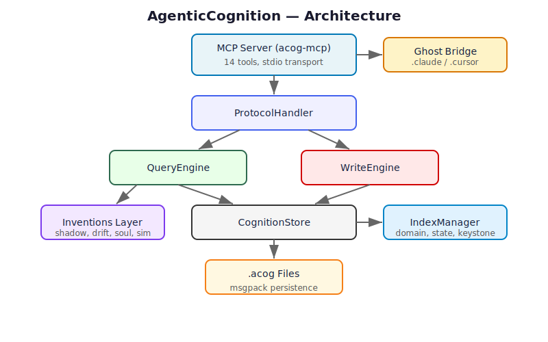
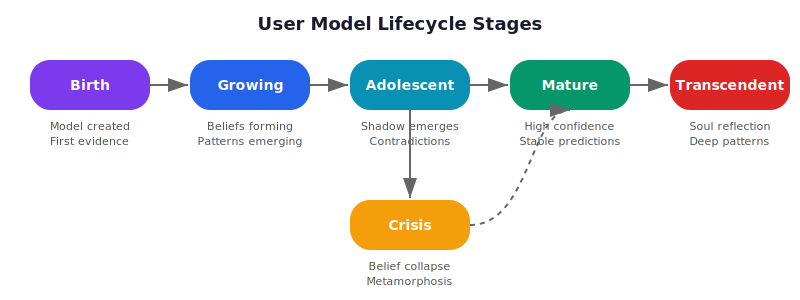
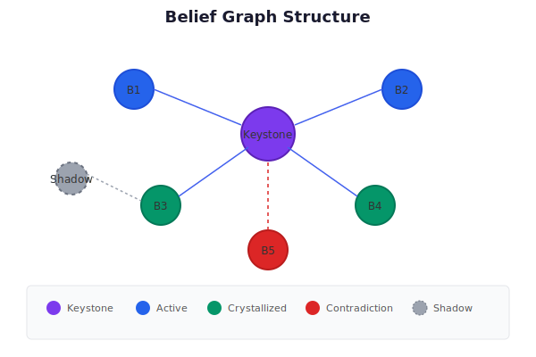
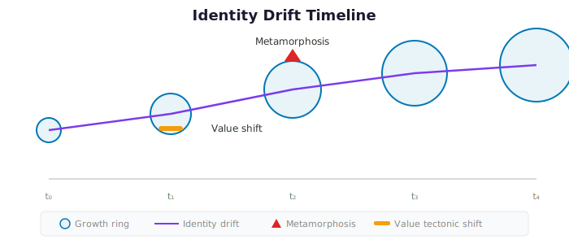

# AgenticCognition

**The Mirror That Knows You Better Than You Know Yourself**

> Sister #9 of 25 in the Agentra ecosystem | `.acog` format | 24 Inventions | 14 MCP Tools

[](LICENSE)
[](https://www.rust-lang.org/)
[](docs/MCP-TOOLS.md)
[](docs/CLI.md)
[](#tests)

---

## The Problem

AI has no theory of YOU.

Every conversation starts fresh. The AI doesn't know that you always overthink decisions. Doesn't notice that your confidence exceeds your competence in finance. Can't see that you've been slowly drifting away from the values you proclaimed two years ago.

**Current AI:** Responds to what you SAY.
**AgenticCognition:** Understands who you ARE -- and who you're BECOMING.

## The Solution

AgenticCognition provides **longitudinal user modeling** -- a living model of human consciousness that:

1. **Evolves** with every interaction
2. **Detects patterns** invisible to the human themselves
3. **Tracks drift** in beliefs, values, and identity over time
4. **Maps blindspots** and shadow beliefs
5. **Simulates** how they would think, choose, and react
6. **Projects** who they're becoming

## Architecture



```
+----------------------------------------------------------+
|                  MCP Server (14 Tools)                     |
+----------------------------------------------------------+
|                   Cognition Engine                         |
|  Write Engine | Query Engine | 24 Inventions | Bridges    |
+----------------------------------------------------------+
|         Storage Layer (.acog + blake3 checksums)           |
+----------------------------------------------------------+
|  Sister Bridges: Memory | Planning | Time | Identity | ...+
+----------------------------------------------------------+
```

## 24 Inventions

| Tier | Inventions | Focus |
|------|-----------|-------|
| **P0: Living Mirror** | Living User Model, Belief Graph, Decision Fingerprint, Soul Reflection | Core consciousness modeling |
| **P1: Belief Physics** | Crystallization, Self-Concept Topology, Belief Drift, Preference Oracle | Physical properties of beliefs |
| **P2: Shadow** | Shadow Beliefs, Projections, Blindspots, Bias Field, Emotional Triggers | Unconscious patterns |
| **P3: Quantum** | Entanglement, Conviction Gravity, Certainty Collapse, Value Tectonics, Metamorphosis | Deep dynamics |
| **P4: Temporal** | Reasoning Fossils, Cognitive Strata, Decision Simulation, Future Projection, Identity Thread, Growth Rings | Archaeology and prediction |

## Quick Start

```bash
# Install
cargo install agentic-cognition-cli

# Create a user model
acog model create
# Output: { "model_id": "550e8400-...", "status": "created" }

# Add beliefs
acog belief add $MODEL_ID "I value honesty above all" --domain values --confidence 0.9
acog belief add $MODEL_ID "Hard work leads to success" --domain world_model --confidence 0.7
acog belief add $MODEL_ID "I'm good at problem-solving" --domain capability --confidence 0.8

# View model portrait
acog model portrait $MODEL_ID

# Get soul reflection
acog model soul $MODEL_ID

# Predict preference
acog predict preference $MODEL_ID "remote work opportunity"

# Simulate decision
acog predict decision $MODEL_ID "Accept promotion?" --options "Accept" --options "Decline"

# Project future self
acog predict future $MODEL_ID --days 180
```

## Model Lifecycle



```
Birth -> Infancy (5+ obs) -> Growth (50+ obs) -> Maturity (200+ obs)
                                                      |
                                                  Crisis -> Rebirth -> Growth
```

## Belief Graph



Beliefs have physics:
- **Crystallization**: Beliefs harden over time
- **Entanglement**: Quantum-linked beliefs change together
- **Gravity**: Strong convictions warp perception
- **Collapse**: Keystone failure cascades

## Drift Tracking



## 14 MCP Tools

| Tool | Description |
|------|-------------|
| `cognition_model_create` | Create a new living user model |
| `cognition_model_heartbeat` | Pulse model with new observations |
| `cognition_model_vitals` | Get model health and vital signs |
| `cognition_model_portrait` | Get full model portrait |
| `cognition_belief_add` | Add a new belief to the model |
| `cognition_belief_query` | Query beliefs by domain or search |
| `cognition_belief_graph` | Get belief graph with connections |
| `cognition_soul_reflect` | Perform deep soul reflection |
| `cognition_self_topology` | Get self-concept topology |
| `cognition_pattern_fingerprint` | Get decision fingerprint |
| `cognition_shadow_map` | Get shadow map |
| `cognition_drift_track` | Track belief drift over time |
| `cognition_predict` | Predict user preference |
| `cognition_simulate` | Simulate user decision |

### MCP Configuration

```json
{
  "mcpServers": {
    "cognition": {
      "command": "acog-mcp",
      "args": ["--storage", "~/.agentic/cognition"]
    }
  }
}
```

## CLI Commands (40+)

| Group | Commands | Count |
|-------|---------|-------|
| `model` | create, show, vitals, heartbeat, portrait, soul, consciousness, list, delete | 9 |
| `belief` | add, show, list, strengthen, weaken, connect, graph, keystones, contradictions, crystallize, collapse, search | 12 |
| `self` | topology, peaks, valleys, blindspots, defended, edges | 6 |
| `pattern` | fingerprint, fossils, strata | 3 |
| `shadow` | map, projections, blindspots | 3 |
| `bias` | field, triggers | 2 |
| `drift` | timeline, tectonics | 2 |
| `predict` | preference, decision, future | 3 |

## Crate Structure

| Crate | Description |
|-------|-------------|
| [`agentic-cognition`](crates/agentic-cognition/) | Core library with types, engines, inventions |
| [`agentic-cognition-mcp`](crates/agentic-cognition-mcp/) | MCP server (14 tools, JSON-RPC stdio) |
| [`agentic-cognition-cli`](crates/agentic-cognition-cli/) | CLI binary (`acog`, 40+ commands) |
| [`agentic-cognition-ffi`](crates/agentic-cognition-ffi/) | FFI bindings (C, Python, WASM) |

## .acog File Format

Binary format with integrity protection:

```
[MAGIC: "ACOG"] [VERSION: u16] [FLAGS: u16] [BODY_LEN: u32]
[BLAKE3_CHECKSUM: 32 bytes]
[JSON_BODY: variable length]
```

- Atomic writes (temp file + rename)
- blake3 checksums for integrity
- Per-project isolation

## Sister Integration

AgenticCognition integrates with 7 Agentra sisters:

| Sister | Bridge | Purpose |
|--------|--------|---------|
| Memory | `MemoryBridge` | Historical context, evidence base |
| Planning | `PlanningBridge` | Goals, decisions, commitments |
| Time | `TimeBridge` | Temporal decay, scheduling |
| Identity | `IdentityBridge` | Trust, signing, verification |
| Codebase | `CodebaseBridge` | Code patterns |
| Vision | `VisionBridge` | Visual patterns |
| Comm | `CommBridge` | Communication style |

All bridges have NoOp defaults -- no dependencies required for standalone operation.

## Dependencies

| Sister | Version | Provides |
|--------|---------|----------|
| Memory | >= 0.4.0 | Historical context, conversation patterns |
| Planning | >= 0.1.0 | Goals, decisions, commitments |
| Time | >= 0.1.0 | Temporal decay, scheduling |

## Privacy Principles

1. **Consent is continuous** -- user controls everything
2. **Transparency is absolute** -- user can see all inferences
3. **Predictions are humble** -- always probabilistic
4. **Growth is the goal** -- help develop, never manipulate
5. **Data is sacred** -- user owns their data completely

## Tests

152 tests across 6 phases:

| Phase | Tests | Coverage |
|-------|-------|----------|
| Phase 1: Types | 35 | Core type system |
| Phase 2: Engine | 45 | Write/query operations |
| Phase 3: Inventions | 28 | All invention modules |
| Phase 4: MCP | 8 | Tool count, quality |
| Phase 5: Format | 17 | .acog persistence |
| Phase 6: Integration | 19 | End-to-end scenarios |

```bash
cargo test --all-features
```

## Documentation

| Document | Description |
|----------|-------------|
| [Quickstart](docs/QUICKSTART.md) | Get started in 5 minutes |
| [Architecture](docs/ARCHITECTURE.md) | System design |
| [API Reference](docs/API.md) | Rust API docs |
| [CLI Reference](docs/CLI.md) | All 40+ commands |
| [MCP Tools](docs/MCP-TOOLS.md) | 14 MCP tools |
| [24 Inventions](docs/INVENTIONS.md) | All inventions explained |
| [Core Concepts](docs/CONCEPTS.md) | Belief physics, shadow, drift |
| [Sister Integration](docs/SISTER-INTEGRATION.md) | Bridge documentation |
| [Examples](docs/EXAMPLES.md) | Usage examples |
| [Privacy & Ethics](docs/PRIVACY.md) | Privacy guide |
| [FAQ](docs/FAQ.md) | Common questions |
| [Troubleshooting](docs/TROUBLESHOOTING.md) | Common issues |

## Contributing

See [CONTRIBUTING.md](CONTRIBUTING.md) for guidelines.

## License

MIT -- See [LICENSE](LICENSE) for details.

---

*Built by [Agentra Labs](https://agentralabs.tech) | Sister #9 of 25 | The Mirror*
